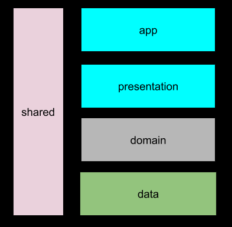

# Shopping List


[](http://www.apache.org/licenses/LICENSE-2.0)


</br>

<a href="https://www.buymeacoffee.com/thiagoolsilva" target="_blank"></a>

## Description

It is a shopping list app that will help user to create its shopping list using online/offline feature by firebase.

The goal of the project is to demonstrate best practices by using up to date tech-stack and presenting modern Android application.


## Table of contents

- [Characteristics](#characteristics)
- [App Screenshot](#app-screenshot)
- [Tech-stack](#tech-stack)
	- [Tech-stack](#tech-stack)
	- [Jetpack](#jetpack)
	- [Tests](#tests)
	- [Static code Analyse](#static-code-analyse)
- [Architecture](#architecture)
	- [What this project does not cover?](#what-this-project-does-not-cover)
	- [Getting started](#getting-started)
	- [Android Studio](#android-studio)
	- [Command-line](#command-line)
	- [Projects](#projects)
- [Author](#author)
- [License](#license)


## Characteristics

This project brings to table set of best practices, tools, and solutions:

* 100% [Kotlin](https://kotlinlang.org/)
* Modularization (app, presentation, domain, data, shared)
* [Android Jetpack](https://developer.android.com/jetpack)
* A single-activity architecture, using the [Navigation component](https://developer.android.com/guide/navigation/navigation-getting-started)
* Testing
* Dependency Injection
* Static code analyse
* [Firebase](https://firebase.google.com/) (Authentication and Firestone)
* CI integration by gihub actions

## App Screenshot


## Tech-stack

### Tech-stack

| Technology   	| Description   	|
|---	|---	|
| [Kotlin](https://kotlinlang.org/) + [Coroutines](https://kotlinlang.org/docs/reference/coroutines-overview.html)   	| Perform background operations   	|
| [Koin](https://insert-koin.io/)   	| Dependency injection   	|
| [Firebase authentication](https://firebase.google.com/docs/auth)   	| Authentication   	|
| [Firebase firestone](https://firebase.google.com/docs/firestore)   	| Remote database   	|
| [kotlinx-coroutines-play-services](https://github.com/Kotlin/kotlinx.coroutines/tree/master/integration/kotlinx-coroutines-play-services)   	| Extension function to handle firebase requests   	|
| [Timber](https://github.com/JakeWharton/timber)   	| Logging   	|
| [core-ktx](https://developer.android.com/kotlin/ktx)   	| Kotlin extensions   	|
| [swiperefreshlayout](https://developer.android.com/jetpack/androidx/releases/swiperefreshlayout)   	| Visual refresh layout   	|

### [Jetpack](https://developer.android.com/jetpack)

| Technology   	| Description   	|
|---	|---	|
| [Navigation](https://developer.android.com/topic/libraries/architecture/navigation/)   	| Deal with whole in-app navigation   	|
| [LiveData](https://developer.android.com/topic/libraries/architecture/livedata)   	| Notify views about database change   	|
| [Lifecycle](https://developer.android.com/topic/libraries/architecture/lifecycle)   	| Perform an action when lifecycle state changes   	|
| [ViewModel](https://developer.android.com/topic/libraries/architecture/viewmodel)   	| Store and manage UI-related data in a lifecycle conscious way   	|
| [Constraintlayout](https://developer.android.com/reference/androidx/constraintlayout/widget/ConstraintLayout)   	| Allows to build  flexible layout   	|
| [Test](https://developer.android.com/training/testing/)   	| Tests   	|


### Tests

| Technology   	| Description   	|
|---	|---	|
| [Unit Tests](https://en.wikipedia.org/wiki/Unit_testing) ([JUnit](https://junit.org/junit4/))
[core-testing](https://androidx.tech/artifacts/arch.core/core-testing/)   	| Used to sync background tasks   	|
| [kotlinx-coroutines-test](https://kotlin.github.io/kotlinx.coroutines/kotlinx-coroutines-test/)       | Used to sync coroutines jobs       |
| [mockk](https://mockk.io/)       | Mock objects using kotlin's style       |

### Static code Analyse

| Technology   	| Description   	|
|---	|---	|
| [Klint](https://ktlint.github.io/#getting-started)   	| An anti-bikeshedding Kotlin linter with built-in formatter.   	|

* Architecture
    * Clean Architecture (at module level)
    * MVVM (presentation layer)
* Gradle


## Architecture

The application is separated  in modules as displayed below



## What this project does not cover?

The project does not cover e2e and integration tests once it will be implemented as soon as possible.

## Getting started

There are a few ways to open this project.

### Android Studio

1. Android Studio -> File -> New -> From Version control -> Git
2. Enter `https://github.com/thiagoolsilva/ShoppingList` into URL field

### Command-line

1. Run `git clone https://github.com/thiagoolsilva/ShoppingList`
2. Android Studio -> File -> Open

### Projects

Other high-quality projects will help you to find solutions that work for your project:

* [books jetpack](https://github.com/nglauber/books_jetpack) - a showcase that uses jetpack components
* [Android sunflower](https://github.com/googlesamples/android-sunflower) complete `Jetpack` sample covering all  libraries
* [Clean Architecture boilerplate](https://github.com/bufferapp/android-clean-architecture-boilerplate) - contains nice  diagrams of Clean Architecture layers

## Author

<table>
    <tr>
        <td align="center"><a href="https://github.com/thiagoolsilva">
            
            <br>
            <sub><b>Thiago Lopes</b></sub>
            <br>
            <a href="https://medium.com/@thiagolopessilva" title="Medium">
                
            </a>
            <a href="https://www.linkedin.com/in/thiago-lopes-silva-2b943a25/" title="Linkedin">
                
            </a>
            <a href="https://twitter.com/thiagoolsilva" title="Twitter">
                
            </a>
        </td>
    </tr>
</table>


## License
```
Copyright (c) 2020  Thiago Lopes da Silva

Licensed under the Apache License, Version 2.0 (the "License");
you may not use this file except in compliance with the License.
You may obtain a copy of the License at

    http://www.apache.org/licenses/LICENSE-2.0

Unless required by applicable law or agreed to in writing, software
distributed under the License is distributed on an "AS IS" BASIS,
WITHOUT WARRANTIES OR CONDITIONS OF ANY KIND, either express or implied.
See the License for the specific language governing permissions and
limitations under the License.
`
